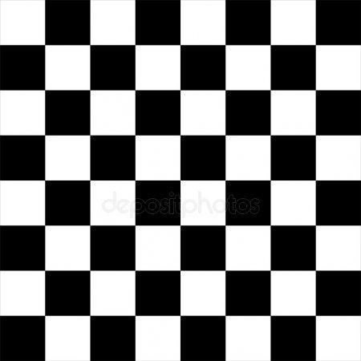

# 🧠 PyChess Engine

A simple but functional chess engine built using Python and Pygame. It supports basic piece movement, board rendering, and AI moves using the Minimax algorithm with alpha-beta pruning.



---

## 🧩 Features

- Full 8x8 chessboard rendering using `board.jpg`.
- All standard chess pieces with images in the `pieces/` folder.
- Player vs AI gameplay.
- AI logic based on Minimax with evaluation heuristics.
- Interactive click-based move system using Pygame.

---

## 📁 File Structure

```
.
├── chess.py          # Main engine and UI
├── board.jpg         # Background image for the board
├── selectedbox.jpg   # Highlight image when a piece is selected
├── pieces/           # Folder containing piece images (e.g., wp.png, bki.png)
│   ├── wp.png        # White Pawn
│   ├── bki.png       # Black King
│   └── ...           # (All other pieces and their selected variants like s<piece>.png)
```

---

## 🕹️ Controls

- **Click on a piece** to select it.
- **Click on a destination square** to move.
- AI will respond with its move automatically.

---

## ♟️ Pieces Naming Convention

| Symbol | Description      |
|--------|------------------|
| `p`    | Pawn             |
| `r`    | Rook             |
| `k`    | Knight           |
| `b`    | Bishop           |
| `q`    | Queen            |
| `ki`   | King             |

Examples:
- `wp` = White Pawn
- `bki` = Black King

---

## 🧠 AI

- The AI uses a depth-limited **Minimax algorithm with alpha-beta pruning**.
- The evaluation function gives weight to material (e.g., Queen = 9, Pawn = 1).
- The AI makes moves based on maximizing or minimizing score depending on turn.

---

## 🚀 How to Run

### 🛠 Requirements

- Python 3.x
- `pygame`
- `numpy`

Install dependencies:

```bash
pip install pygame numpy
```

### ▶️ Run the Game

```bash
python chess.py
```

---

## 🛠 To Do

- Add support for castling, en passant, promotion.
- Implement check/checkmate detection.
- Improve UI for move highlighting and valid moves.
- Add a main menu or difficulty settings.

---

## 📸 Screenshots

| Default Position | Piece Selection |
|------------------|-----------------|
|  |  |

---

## 📃 License

Feel free to modify and build upon this project for educational or personal use.
